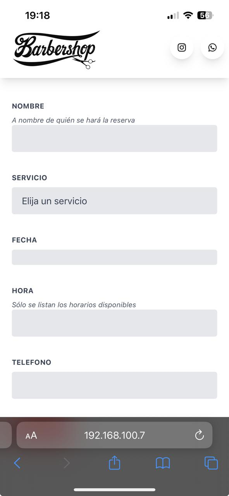

# barberiApp

Esta es una aplicacion web responsive, para realizar reservas de servicio de corte de pelo y barba. Aplicable a un pymes.

Tecnologías:

- Python
- Flask
- Gunicorn
- Datetime
- Google API Client
- TailwindCSS
- Javascript
- Jinja2

